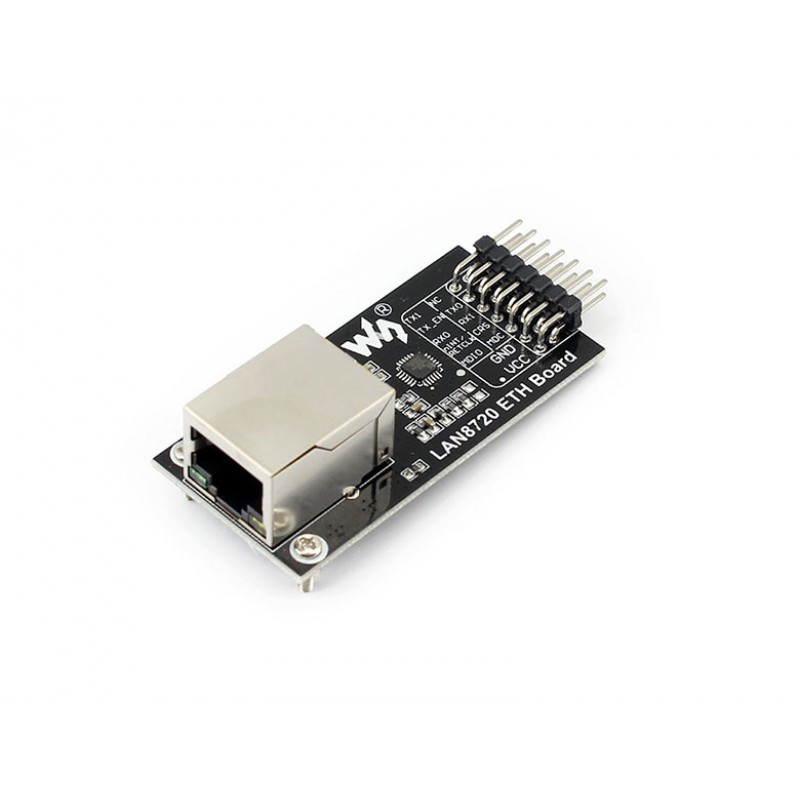
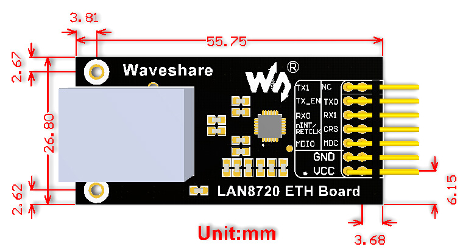

# LAN8720 ETH Board

## Features

- High-Performance 10/100 Ethernet Physical Layer Transceiver (PHY)
- Supports single 3.3V supply
- Supports the reduced pin count RMII interface
- Supports HP Auto-MDIX
- Onboard chip package: 24-pin QFN (4x4 mm) Lead-Free RoHS Compliant package
- Flexible Power Management Architecture
- Integrated 1.2V regulator
- I/O voltage range: +1.6V to +3.6V

## Applications

- Embedded web server

## Dimension

## Downloads

Development resources: demo codes, schematic, datasheets, etc.

Wiki: [www.waveshare.com/wiki/LAN8720 ETH Board](http://www.waveshare.com/wiki/LAN8720%20ETH%20Board)